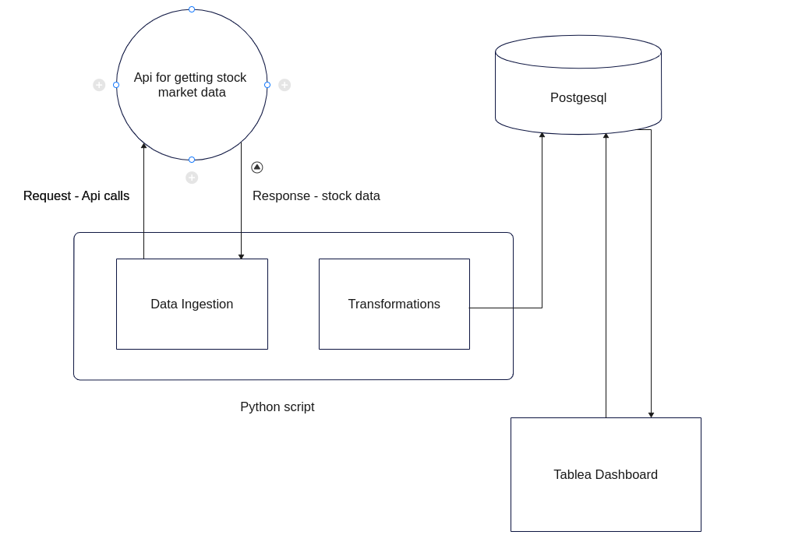

# DATA PIPELINE ASSIGNMENT

## Scope
### Pipeline Implementation
##### `Architecture Diagram`


##### `Key points`

1. A mock API to simulate real-time market data is set. The api demonstrates real-time-data api from stock market.
2. A basic and simple pipeline that ingests, processes and stores this data is designed and implemented.
3. The pipeline only works in a real-time manner till the data ingestion and storage to Postgresql table.
4. Tableau cannot be incorporated with this pipeline as it is not a paid version, but images of dashboard are attached.


### Data Governance and Data Structures
##### `Key points`
1. A basic data governance framework suitable for market data is outlined.
2. A dabase schema is devloped and implemented it using a `Postgresql` database.


### Python Scripting
1. A python script is written to simulate data scraping (ingestion), to perform necessary transformation required to store the data in the postgresql table.

### Tableau Visualization
1. A Tableau dashboard was developed that includes 3 different types of visualizations: time-series chart, bar chart, heatmap.
2. The dashboard created is interactive and user-friendly.

## Out of scope
### Pipeline Implementation
##### `Key points`
There are a lot of ways this problem can be solved, there is no one solution for this. Implementing different solution within this time constraint is not feasible because of the following reasons:
- lack of infrastructure available to test locally
- lack of time to set up and implement a large solution

### Tableau Visualization
1. A real-time dashboard cannot be made as the Tableau public available for free does not have the features to connect to postgresql database.


## How to setup
#### Install dependencies
1. Clone this repository
```
git clone git@github.com:vishnu5898/data-pipeline-assignment.git
```
If did not work, download the zip file and unzip the file.

2. Change the directory
```
cd data-pipeline-assignment
```
3. Install dependencies
```
sudo apt update
sudo apt install virtualenv
```
4. Create virtual environment and activate it
```
virtualenv -p python3.10 .venv
source .venv/bin/activate
```
5. Install the python dependencies
```
pip install -r requirements.txt
```

#### Setup Postgresql database
1. Install postgres locally
```
sudo sh -c 'echo "deb https://apt.postgresql.org/pub/repos/apt $(lsb_release -cs)-pgdg main" > /etc/apt/sources.list.d/pgdg.list'

wget --quiet -O - https://www.postgresql.org/media/keys/ACCC4CF8.asc | sudo apt-key add -

sudo apt-get update
sudo apt-get -y install postgresql
```
2. Create database, username and password. Run this command in terminal `sudo su postgres`. Now you will be logged in as postgres user. Enter `psql` in command line. Now you will be logged in to psql client. After that run these commands to create database and username. Instead of `test_user` and `test_password` use your username and password.
```
CREATE DATABASE market_data;
CREATE USER test_user USING PASSWORD 'test_password';
ALTER DATABASE market_data OWNER TO test_user;
```
3. Now you quit the psql client by running `\q` in interactive session.
4. Once you are out of the psql client session. Enter `exit` to come back to the default user session in terminal window.

#### Run pipeline
1. We have to provide credentials of the database to which the igested data can be stored
2. Run the commands to start the server for stock data mock api
```
source env.sh
python -m server
```
3. Open another terminal session and change directory to this repository
```
cd data-pipeline-assignment
```
Create a new file `env.sh`. Run this command to create the file `touch env.sh`. Paste the below variables and values to this file and then save the file. Please make sure to give the correct value to the variable.
```
export PG_USERNAME=test_user
export PG_PASSWORD=test_password
export PG_DATABASE=market_data
```
Run these commands in the terminal to start the pipeline
```
source .venv/bin/activate
source env.sh
python -m main
```

## Deliverable
#### Tableau Dashboard
The dashboard created is published in this link. [Click here](https://public.tableau.com/app/profile/vishnu.p.s/viz/stock_17084578685070/Dashboard1#1)


### Governance Framework

##### Data Governance Policy

###### Introduction
Data governance is both an organizational process and a structure. It establishes responsibility for data, organizing program area staff to collaboratively and continuously improve data quality and use.It does this through the systematic creation and enforcement of policies, roles, responsibilities, and procedures.

###### Mission of the Data Governance Program 

- Improve the privacy and security of the data, including confidentiality and protection fromloss.
- Establish appropriate responsibility for the management of data as an organizational asset.
- Improve ease of access and ensure that once data are located, users have enough information about the data to interpret them correctly and consistently.
- Improve the quality of the data,resulting in greater accuracy,timeliness, and integrity of information for decision making. 
Ensure all data-related issues are resolved via the data governance structure adopted per this policy.

###### Data Governance Strategy 
Anyone who creates, manages or uses company data is affected by this policy. Data governance executive sponsors, data owners, data stewards, and all other employees who use data, regardless of the form of storage or presentation, should be familiar with this policy.
This Data Governance Policy shall be maintained by the manager of the Data Governance Program.

###### Intended Outcomes
- A common vision for and more effective data use in support of agency goals and strategic initiatives.
- Improved data quality.
- Improved understanding of data collected, reported, and used by each program and the agency as a whole.
- Increased consistency and reduced redundancy of data collected across the agency.
- Security and privacy of data are maintained and enforced.
- More effective communication and coordination among programs – agency-wide responses to critical data issues 
- Decreased staff burden (over time).


###### Data Management Functions/Knowledge Areas
A policy shall be documented for each data management function/knowledge area represented in the below. These policies must be referenced when reviewing or updating current data management procedures or when developing new data management procedures across the agency.
At a minimum, each policy shall be reviewed and updated annually. The data management functions/knowledge areas include:
- Data Architecture
- Data Modeling and Design
- Data Storage and Operations
- Data Security
- Data Integration and Interoperability
- Documents and Content
- Data Warehousing and Business Intelligence
- Data Quality

###### Data Architecture


Key Data Governance Roles
---
###### Data Policy Committee (DPC)
---
The Data Policy Committee is comprised of Directors, the Deputy Commissioner of Education, and the Data Governance Coordinator. The DPC members are responsible for data governance within their program areas to help model and reinforce that data governance is an agency-wide initiative and that all staff should be aware of and comply with data policies.

###### Key Responsibilities:
---
- Set the vision and priorities for data use in the agency.
- Resolve issues escalated from the Data Governance Committee.
- Approve proposed agency-wide data policies and processes.
- Communicate with the Data Governance Committee members who report to them to prepare for each DPC discussion and decision.
- Including data governance responsibilities in the performance expectations of their staff who are members of the Data Governance Committee and Data Steward Committee.
- Hold all their staff responsible for adhering to the data policies and processes established
through data governance

Data Governance Roles
---
###### Executive Sponsor
An executive sponsor is a member of senior leadership who has planning and policy responsibility and accountability for major administrative data systems within their functional areas. By understanding the planning needs of the state, they are able to anticipate how data will be used to meet state and organizational needs.

###### Data Owners
Data owners are appointed by the executive committee. They are typically directors or managers who have authority to determine business definitions of data, grant access to data, and approve the secure usage of those data, for the functional areas within their delegations of authority. By understanding the information needs of the agency, data owners are able to anticipate how agency data can be used to strategically meet the agency’s mission and goals.

###### Data Custodians 
Data custodians are responsible for the operation and management of technology and systems that collect, store, process, manage, and provide access to agency data. Data custodians typically are associated with technical functions of the agency, but may also include systems administrators within all functional areas.

###### Data Stewards
Data stewards are responsible for implementing data policies. Additionally, data stewards have
responsibility and authority for the day-to-day management of one or more types of agency data. Data stewards authorize and monitor the secure use of data within their functional areas to ensure appropriate access, accuracy, classification, privacy and security.

###### Data Users
Data users are authorized individuals who have been granted access to agency data in order to perform assigned duties or functions within the agency. When individuals become data users, they assume responsibility for the appropriate use, management and application of privacy and security standards for the data they are authorized to use. As such, data users must work with data stewards and data custodians to ensure that they understand any use of agency data beyond the initial scope requires approval by the appropriate data steward.


The scope of data governance includes
- Data access: Each data owner with a business owner of the company System will determine
which roles will have access to the systems that pertain to their bureau areas. They will also
determine who is granted access to which data and at what granularity within the system.
- Data requests: Establish and communicate the way in which data will be requested from
within and outside the Agency, including how those requests will be reviewed,
approved/denied, and fulfilled.
- Data collection: Determine how necessary changes to data collections are identified, defined,
approved, communicated, and executed.
- Data validation: Create and maintain a policy for which edit checks will be established and
how data will be validated at each point in the lifecycle and corrected at the source (if need
be).
- Data release/reporting: Determine how data will be frozen, compiled, checked, formatted,
approved, and communicated for external release.
